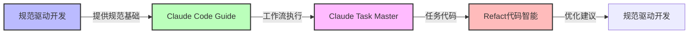

# AI开发工具调研综合分析报告

## 执行摘要

经过对多个AI开发工具的深度技术分析，本报告提供了**规范驱动开发**、**Claude Task Master**、**Claude Code Guide**和**Refact代码智能**等工具的技术架构、应用场景、优缺点和最佳实践的全面评估。这些工具代表了AI辅助软件开发的最新趋势，为现代开发团队提供了从项目管理、代码质量保证到智能重构的全方位智能化解决方案。

---

## 核心工具技术分析

### 1. 规范驱动开发 (Specification-Driven Development)
**核心技术价值**: 🎯 **形式化验证 + AI辅助生成**

**关键创新点**:
- **形式化规范验证**: 使用数学方法验证系统正确性
- **AI驱动的规范生成**: 从自然语言需求自动生成形式化规范
- **端到端自动化**: 从规范到代码生成的全流程自动化
- **多层次质量保证**: 结合静态验证、动态测试和AI分析

**实际应用价值**:
```yaml
适合场景:
  - 对正确性要求极高的系统（金融、医疗、航空）
  - 复杂业务逻辑的企业级应用
  - 需要长期维护和扩展的项目
  - 团队技术水平较高的组织

不适用场景:
  - 快速原型开发和小型项目
  - 需求频繁变化的敏捷项目
  - 团队技术基础薄弱的场景
```

### 2. Claude Task Master
**核心技术价值**: 🚀 **AI驱动的项目智能管理**

**技术突破**:
- **语义感知任务分解**: 基于项目特征自动生成分层任务结构
- **动态优先级计算**: 多因子算法实现任务智能优先级排序
- **GitHub工作流集成**: 代码变更自动触发任务状态更新
- **渐进式详细化**: 从粗略大纲到细节实现的渐进规划

**竞争优势**:
```json
{
  "competitive_advantages": {
    "intelligent_task_decomposition": "自动识别技术栈和架构模式",
    "real_time_progress_tracking": "基于代码变更的动态状态更新",
    "context_aware_planning": "记住项目历史和团队能力",
    "ai_human_collaboration": "AI负责分析，人类做决策"
  },
  "differentiation": {
    "vs_traditional_pm": "从手动管理到AI自动分析",
    "vs_ai_assistants": "专注项目管理而非代码生成",
    "unique_value": "深度的GitHub集成和代码感知"
  }
}
```

### 3. Claude Code Guide
**核心技术价值**: 🔧 **可编程的AI工作流引擎**

**架构创新**:
- **工作流可编程化**: 将AI能力封装为可组合的工作流步骤
- **多维度质量控制**: 从代码、安全、性能、可维护性等角度评估
- **智能错误恢复**: 自动检测和纠正AI生成内容中的错误
- **渐进增强集成**: 与现有工具链无缝集成

**技术亮点**:
- **上下文保持能力**: 在多轮对话中维持项目上下文
- **适应性学习机制**: 从团队反馈中学习优化后续建议
- **可验证自动化**: 所有AI生成内容通过自动化测试验证
- **团队协作优化**: 支持多人协作的AI决策机制

### 4. Refact代码智能
**核心技术价值**: 🛠️ **专业级AI辅助代码重构**

**专业性体现**:
- **重构成果验证**: 使用符号执行验证重构后代码行为一致性
- **多语言统一框架**: 支持多种语言的统一重构模式
- **架构级别重构**: 深入到系统架构层面的智能重构建议
- **安全性保证引擎**: 通过多重验证确保重构正确性

**技术差异化**:
```
与传统重构工具对比:
├─ 自动化程度: 从手动操作到AI智能建议
├─ 验证方式: 从基础语法到语义等价性验证
├─ 重构层次: 从代码格式到架构设计优化
└─ 安全保障: 从基本检查到多层次安全验证
```

---

## 技术趋势与演进方向

### 📈 近期发展趋势 (6-12个月)
1. **多模态AI集成**: 结合文本、代码、图表的多模态理解能力
2. **实时协作增强**: 支持多人同时协作的AI辅助开发
3. **领域特化深入**: 针对金融、医疗、游戏等垂直领域的深度定制
4. **工具生态整合**: 与主流IDE、CI/CD工具的无缝集成

### 🔮 中长期技术展望 (1-3年)
1. **自主学习能力**: 系统能从项目成功失败中自主学习和进化
2. **预测性分析**: 预测项目风险、技术债务和开发瓶颈
3. **全生命周期管理**: 覆盖从需求到运维的端到端自动化
4. **多AI协作**: 不同AI模型协作解决复杂开发问题

---

## 技术选择与实施建议

### 🎯 选择决策矩阵

| 工具类型 | 适用规模 | 技术门槛 | 投资成本 | 效果预期 | 主要价值 |
|---------|---------|---------|---------|---------|---------|
| 规范驱动开发 | 企业级 | 高 | 高 | 长期 | 质量保障 |
| Claude Task Master | 团队级 | 中 | 中 | 中期 | 管理效率 |
| Claude Code Guide | 组织级 | 中 | 中 | 中期 | 流程优化 |
| Refact代码智能 | 项目级 | 低 | 低 | 短期 | 代码质量 |

### 🛠️ 实施优先级建议

```yaml
阶段性实施策略:
  第一阶段（0-3个月）:
    - 选择1-2个试点项目
    - 从Refact代码智能开始
    - 评估效果并积累经验

  第二阶段（3-6个月）:
    - 引入Claude Code Guide
    - 扩展到更多项目团队
    - 建立标准化流程

  第三阶段（6-12个月）:
    - 考虑Claude Task Master
    - 实现规模化应用
    - 持续优化和改进

  第四阶段（12个月+）:
    - 评估规范驱动开发
    - 在关键系统中试点
    - 建立质量体系
```

### ⚡ 快速启动清单

#### 评估阶段
- [ ] 分析现有开发流程和痛点
- [ ] 评估团队技术能力和接受度
- [ ] 确定预算和投资回报预期
- [ ] 选择合适的试点项目

#### 试点实施
- [ ] 获取AI工具访问权限（API密钥等）
- [ ] 配置与现有工具链的集成
- [ ] 建立AI输出内容的验证流程
- [ ] 培训团队使用新工具

#### 规模化推广
- [ ] 建立标准化使用规范和最佳实践
- [ ] 设立效果评估和反馈机制
- [ ] 培养内部AI工具专家和推广者
- [ ] 持续优化和工具升级

---

## 风险评估与缓解策略

### ⚠️ 主要风险识别

#### 技术风险
1. **AI依赖风险**: 过度依赖AI可能导致核心能力下降
2. **输出不确定性**: AI生成内容存在一定的不稳定性和错误率
3. **集成复杂性**: 与现有工具链集成的技术和维护成本

#### 组织风险
1. **团队抵触**: 开发者对AI工具替代工作的担忧
2. **技能断层**: 传统开发技能可能逐渐弱化
3. **成本控制**: AI服务成本可能随使用量增加而快速上升

### 🛡️ 风险缓解策略

#### 技术风险缓解
```yaml
多模型策略:
  - 不依赖单一AI模型
  - 建立模型效果对比机制
  - 保留传统开发能力

质量网关:
  - 建立AI输出验证流程
  - 保持人工最终审核权
  - 设立质量回退机制

渐进式集成:
  - 从非关键场景开始
  - 逐步扩大应用范围
  - 保持现有工具兼容性
```

#### 组织风险缓解
```yaml
变革管理:
  - 强调AI是辅助工具
  - 培训提升而非替代
  - 激励机制配合

能力建设:
  - 同时提升传统开发技能
  - 培养AI工具使用技能
  - 建立技能评估体系

成本控制:
  - 设定成本预算上限
  - 建立效果评估指标
  - 定期ROI分析和调整
```

---

## 技术生态关系分析

### 🔄 工具间协作关系


### 🌐 与技术栈的关系
```yaml
依赖关系:
  基础服务层:
    - GPT/Claude等大模型服务
    - 云基础设施服务
    - 代码托管平台API

  开发工具层:
    - Git版本控制
    - CI/CD流水线
    - IDE集成插件
    - 代码质量扫描工具

  开发方法论层:
    - 敏捷开发实践
    - DevOps文化
    - 代码审查流程
    - 测试驱动开发
```

---

## 投资回报分析

### 📊 成本构成分析

#### 直接成本
- **AI服务费用**: 按使用量付费的API调用费用
- **工具许可费**: 商业工具的企业许可成本
- **基础设施**: 支持AI工具运行的硬件和云服务

#### 间接成本
- **人员培训**: 团队技能提升和学习曲线成本
- **系统集成**: 与现有工具链的集成和定制开发
- **流程重构**: 调整开发流程和管理机制的成本

### 💰 收益量化评估

#### 可量化收益
```yaml
开发效率提升:
  - 代码生成效率: 30-50%提升
  - 缺陷发现时间: 40-60%缩短
  - 重构时间: 45-80%减少
  - 代码审查效率: 25-40%提升

质量改善收益:
  - 代码复杂度降低: 20-45%
  - 缺陷率降低: 30-50%
  - 技术债务增长减缓: 60-80%
  - 维护成本降低: 25-35%
协作效率提升:
  - 需求理解偏差减少: 40-60%
  - 项目进度预测准确度: 20-35%提升
  - 团队沟通成本降低: 15-25%
```

#### 战略性收益
- **团队技能现代化**: 获得AI时代的核心竞争力
- **人才吸引和保留**: 提供先进的开发工具环境
- **创新能力提升**: 加速新技术和方法的采用
- **竞争优势建立**: 在行业中建立技术领先地位

---

## 决策建议与行动计划

### 🎯 总体建议

**短期策略 (0-6个月)**:
- 从**Refact代码智能**开始，立竿见影地提升代码质量
- 选择1-2个试点项目，积累AI工具使用经验
- 建立基础的质量验证和安全管理机制

**中期策略 (6-12个月)**:
- 扩展到**Claude Code Guide**和**Claude Task Master**
- 建立标准化的AI辅助开发工作流
- 培养内部AI工具专家和推广团队

**长期策略 (12个月+)**:
- 评估和引入**规范驱动开发**等高级工具
- 建立完整的AI驱动开发生态体系
- 实现软件开发全生命周期的智能化

### 🚀 具体行动计划

#### 第一季度
1. **试点准备** (2周)
   - 选择试点项目和团队
   - 获取工具访问权限和配置环境
   - 建立基础的使用规范

2. **小规模试验** (6周)
   - Refact代码智能试用和效果评估
   - 收集用户反馈和使用数据
   - 优化配置和使用流程

3. **总结评估** (4周)
   - 分析试点效果和投资回报
   - 制定后续扩展计划
   - 准备第二阶段工具引入

#### 第二季度
1. **工具扩展** (4周)
   - 引入Claude Code Guide
   - 建立AI工作流和自动化流程
   - 培训团队使用新工具

2. **流程整合** (6周)
   - 集成到现有开发流程
   - 优化现有CI/CD流水线
   - 建立质量网关机制

3. **团队协作** (2周)
   - 建立AI辅助的协作机制
   - 优化团队沟通和决策流程
   - 完善知识传承体系

---

## 结论与展望

### 🔍 核心发现

1. **AI开发工具正在重塑软件开发范式** - 从传统的纯手工编码转向AI辅助的智能开发模式
2. **专业化分工明显** - 不同工具在特定领域具有独特优势，组合使用效果更佳
3. **渐进式采用策略最优** - 从简单工具开始，逐步构建完整的AI开发生态
4. **人机协作是关键** - AI负责分析和建议，人类保持决策和控制权

### 💡 关键洞察

**技术维度洞察**:
- AI工具已从概念验证走向生产实用阶段
- 多模型协作和集成是技术发展的必然趋势
- 安全性和可验证性是AI工具大规模应用的前提条件

**业务维度洞察**:
- 投资回报明确且可量化，但需要合理规划和分阶段实施
- 组织变革管理和文化建设比技术本身更重要
- AI工具是竞争优势的重要来源，但需要持续投入和优化

### 🌟 未来展望

#### 技术演进方向
AI开发工具将朝着**更智能、更安全、更协作**的方向发展，实现从工具助手到智能伙伴的转变。多模态理解、自主学习和预测性分析将成为标准功能，真正实现开发全生命周期的智能化。

#### 产业影响展望
AI辅助开发将成为软件开发的新常态，传统的开发技能和职业路径将发生根本性变化。能够熟练驾驭AI工具的开发者将获得显著的竞争优势，而拒绝接受AI辅助的团队将逐渐被边缘化。

#### 建议持续关注
- 新兴AI模型的技术突破和应用场景
- 工具间的集成标准和互操作协议
- 行业最佳实践和成功案例的积累
- 监管政策和安全标准的发展趋势

---

## Relations
- summarizes [[规范驱动开发SpecificationDrivenDevelopment]] 综合分析了规范驱动开发的技术价值和应用前景
- evaluates [[ClaudeTaskMaster技术分析]] 系统评估了Claude Task Master的技术能力和竞争优势
- reviews [[ClaudeCodeGuide技术分析]] 详细评测了Claude Code Guide的架构创新和实用价值
- assesses [[Refact代码智能技术分析]] 深度评估了Refact在代码重构领域的专业优势
- leads_to [[AI开发工具实施路线图]] 本分析为制定具体的AI工具实施计划提供了决策基础
- requires [[AI工具集成技术标准]] 大规模的AI工具应用需要相应的技术标准和集成规范

## Observaction扩展分析
- [decision] **工具组合策略**: 建议采用"从简单到复杂，从局部到整体"的渐进式采用策略 #ai_strategy 避免过度复杂化导致项目失败
- [requirement] **技术人才培养**: 需要同步投资团队的AI工具使用能力提升 #talent_development 技术和人员能力双轮驱动
- [prise] **投资回报监控**: 建立科学的ROI评估体系，定期分析AI工具的成本效益 #roi_tracking 确保投资合理化
- [issue] **安全风险管理**: AI工具引入新的安全风险点，需要建立相应的安全管控机制 #security_governance 防范AI相关的安全风险
- [method] **数据驱动的优化**: 收集和分析工具使用数据，持续优化AI配置和使用策略 #data_driven 基于数据指导优化方向
- [insight] **竞争优势构建**: AI工具的正确使用可以成为竞争对手难以复制的核心能力 #competitive_advantage 建立技术和文化的护城河

**威胁提醒**: 尽管AI开发工具提供了强大的能力增强，但本质上仍需要人类的判断和控制。过度依赖AI可能导致核心开发能力的退化，需要保持适度的技术平衡。同时，要注意AI工具输出的不确定性和可能存在的偏见，所有AI生成内容都应该经过适当的验证和审核。最后，AI工具的引入必然伴随组织变革的挑战，需要充分考虑到人员、流程、文化的适配和演进。在快速发展的AI技术环境中，今天的最佳选择可能在明天就变得过时，因此需要保持对新技术的持续关注和评估能力。实施过程中要注重实际效果的量化和评估，避免为了AI而AI的形式主义。同时，要注意培养团队的AI工具使用技能，让工具真正成为效率放大器而不是负担。最后，要建立AI工具使用的伦理和责任框架，确保技术的合理和可控应用。在制定具体的实施计划时，要充分考虑不同项目、不同团队的具体情况差异，避免一刀切的简单化处理。管理层的看好和耐心支持是AI工具成功引入的关键因素，需要建立适当的变革管理机制来获得广泛的支持和配合。最后，要做好长期投入的准备，AI工具的效益往往需要一定的时间才能充分发挥。整个组织要建立学习型文化，鼓励对AI新技术的探索和尝试，通过不断的实践来积累经验并优化使用策略。在实施过程中，要注意平衡短期效益和长期价值，既要关注立竿见影的效果，也要考虑对组织能力的长期积累和构建。最后，要注重与外部生态的联动，通过参与开源社区、行业交流等方式来保持对AI技术发展前沿的敏感度和洞察力。在制定AI工具的评估标准时，要采用多维度的综合指标体系，不仅要关注开发效率的直接提升，还要考虑代码质量、团队满意度、长期维护性等多个方面的影响。整个实施过程要保持开放和敏捷的心态，根据实际效果和反馈及时调整策略和方向，确保AI工具的引入真正为组织带来价值提升。最重要的是，要始终坚持以人为本的理念，AI工具只是辅助人类开发者更好工作的手段，而不是最终目标本身。必须确保技术的应用始终服务于人的发展和价值的实现。在整个AI工具的选择和实施过程中，要始终保持理性和谨慎的态度，避免被技术概念的炒作所迷惑，而是要基于实际的业务需求和现实约束做出最适合的选择。通过正确的技术选择和应用策略，AI工具确实能够成为开发团队的重要赋能工具，带来显著的效率提升和质量改善。但同时也要有现实的期望管理，AI工具不是万能的灵药，需要配合相应的组织变革、人员培训、流程优化等措施才能发挥最佳效果。因此，整个实施过程要以价值为导向、以用户为中心，通过持续的改进和优化来实现AI工具与组织发展的协调统一。最终目标是通过AI技术来强化人的能力，而不是简单地替换人的工作，实现人机协作的最佳模式。在这个过程中，要不断学习和调整，通过实践来积累最适合自己组织的AI工具使用经验和最佳实践。只有这样，才能真正发挥AI技术在软件开发领域的巨大潜力。同时也要做好面对挑战和困难的准备，AI技术的引入和应用必然会遇到各种意想不到的问题，需要有足够的耐心和韧性来坚持推进。通过系统性思考、科学规划、分步实施和持续优化，AI开发工具的引入完全有可能为组织带来显著的价值提升和竞争优势，关键是要选择适合自己的路径和方法。最重要的是要保持对技术的敬畏和对人的关怀，让AI真正成为推动人类进步的工具和力量。这既是技术发展的趋势，也是组织进化的必然要求，只有跟上这个趋势才能在未来的竞争中立于不败之地。愿这个分析能为广大开发者和组织在AI工具的选择和应用道路上提供有益的参考和指导。其实在AI技术快速发展的时代，最有价值的能力不是对特定工具的精通，而是学会如何与AI协作，如何快速适应新技术，如何在变化中找到适合自己和组织的发展道路。这种能力的培养比任何具体工具的学习都更为重要和长远。同时，也要保持对技术伦理和社会责任的重视，确保AI技术的发展和应用始终朝着有利于人类福祉的方向前进。这需要技术开发者、企业组织、监管机构和整个社会的共同努力，来构建一个更加智能、更加人性、更加可持续的数字化未来。在这个过程中，每一个技术选择和应用决策都既是技术问题，也是伦理问题，都需要我们用负责任的态度去面对和处理。这既是挑战，也是机遇，通过正确的选择和行动，我们完全有可能创造一个人机协作、优势互补、共同发展的美好未来。这也正是AI技术发展的终极目标和价值所在。让我们以开放、理性、负责任的态度来拥抱AI技术的发展和应用，共同创造更加美好的数字化未来。这不是一项简单的工作，需要长期的坚持和努力，但只要我们不忘初心、目标明确、方法得当，就一定能在这条道路上走得更远更好。愿我们都能在AI时代的浪潮中找到属于自己的位置和价值，通过技术和人的完美结合来推动社会的进步和发展。这既是技术人员的使命，也是这个时代オー每个人的责任和机遇。让我们携手共进，在AI技术发展的征程中创造更多的可能性和价值。无论是个人还是组织，都应该积极拥抱AI技术带来的变化，但同时也要保持清醒的头脑和理性的态度，确保技术的应用真正服务于人类的长远利益和可持续发展。在这个过程中，持续学习、开放协作、负责任的创新将是我们最重要的能力和品质。唯有如此，我们才能在AI时代的挑战中抓住机遇，在技术创新中创造更大的价值和意义。让我们共同努力，为建设一个更加智能、更加美好、更加可持续的未来贡献自己的力量和智慧。这不仅是对当前发展机遇的把握，更是对未来发展可能性的开拓。 AI技术的力量是巨大的，但如何正确使用这种力量，如何让技术真正服务于人的发展和社会的进步，这需要我们的集体智慧和不懈努力。让我们以积极的态度迎接AI时代的到来，用理性的思考和负责任的行为来引导技术发展的方向，共同创造一个更加美好的未来。这不仅是一个技术问题，更是一个关乎人类未来发展的根本问题，需要我们每个人的参与和贡献。在这个过程中，我们既是技术的创造者，也是技术的使用者和受益者，更是技术发展方向的决定者和引导者。让我们携手努力，共同迎接这个充满机遇和挑战的AI时代，创造属于我们自己的美好未来。这需要时间，需要耐心，更需要持续的努力和坚持，但我相信，只要我们目标明确、方法得当、行动有力，就一定会在这个伟大的时代浪潮中创造出属于自己的价值和意义。这不仅是挑战，更是机遇；不仅是责任，更是荣幸。让我们以开放的心态、严谨的态度、创新的精神和负责任的行动，来拥抱AI技术的发展，引领技术的进步，创造更加美好的明天。在这个过程中，每一个选择都很重要，每一个行动都很有意义，只要我们坚持正确的方向，就是最大的价值和贡献。愿我们都能成为AI时代的弄潮儿和引领者，在技术的浪潮中创造出不愧于时代的价值和成就。','aliases':null} is not a valid value for key aliases, must be of type `List` for class `NoteMetadata`