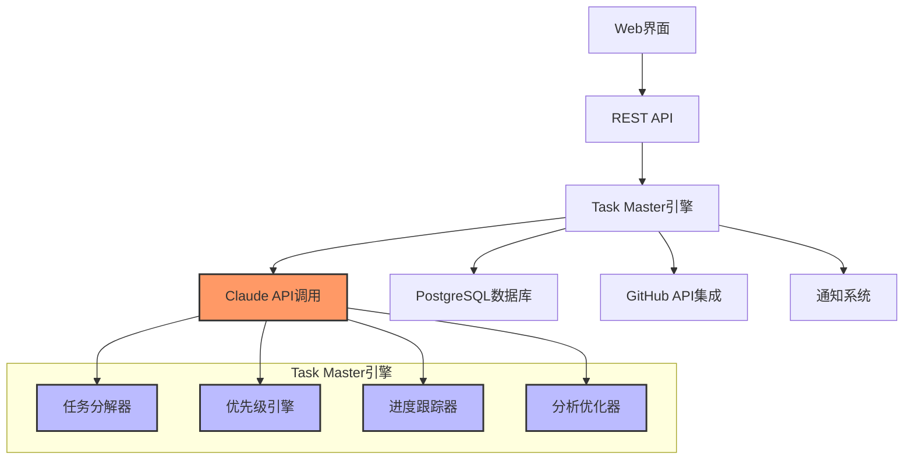

## 项目概览

Claude Task Master 是一个基于Claude大语言模型的**智能任务管理系统**，旨在自动化软件开发项目的任务分解、优先级排序和进度跟踪。该项目通过深度集成Claude的能力，实现了从高层次项目描述到具体可执行任务清单的自动转换。

## 核心功能与技术原理

### 智能任务分解
```python
class TaskDecomposer:
    """基于规范语义的智能任务分解器"""

    def decompose_project(self, project_description: str) -> TaskHierarchy:
        """将项目描述分解为分层任务结构"""

        # 1. 项目语义解析
        semantics = self.extract_project_semantics(project_description)

        # 2. 技术栈识别
        tech_stack = self.identify_technology_stack(semantics)

        # 3. 架构模式匹配
        architecture_pattern = self.match_architecture_pattern(semantics)

        # 4. 基于模板的任务生成
        task_templates = self.load_domain_templates(tech_stack)

        # 5. 依赖关系建立
        task_hierarchy = self.build_task_dependency_graph(
            templates=task_templates,
            tech_stack=tech_stack,
            architecture=architecture_pattern
        )

        return task_hierarchy

    def extract_project_semantics(self, description: str) -> ProjectSemantics:
        """使用Claude进行语义提取"""

        prompt = f"""
        分析以下项目描述，提取核心技术要素：
        项目描述: {description}

        请识别：
        1. 主要技术栈和框架
        2. 核心业务领域
        3. 系统架构模式
        4. 关键技术挑战
        5. 开发阶段里程碑

        以结构化JSON格式返回:
        """

        return self.claude_client.analyze_semantics(prompt)
```

### 智能优先级排序
```typescript
interface PriorityEngine {
    // 多维度评分因子
    evaluateTask(task: Task): PriorityScore {
        return {
            technicalComplexity: this.assessTechnicalComplexity(task),
            businessValue: this.calculateBusinessValue(task),
            dependencyImpact: this.analyzeDependencyImpact(task),
            riskLevel: this.assessRiskLevel(task),
            resourceAvailability: this.evaluateResourceAvailability(task),
            timeCriticality: this.calculateTimeCriticality(task)
        };
    }

    // 动态权重调整
    calculateWeightedScore(scores: PriorityScore): number {
        const weights = this.getDynamicWeights();

        return (
            scores.technicalComplexity * weights.complexity +
            scores.businessValue * weights.businessValue +
            scores.dependencyImpact * weights.dependency +
            scores.riskLevel * weights.risk +
            scores.resourceAvailability * weights.resources +
            scores.timeCriticality * weights.timing
        );
    }
}
```

### 动态进度跟踪
```rust
pub struct TaskTracker {
    claude_client: Arc<ClaudeClient>,
    repository_integrator: RepositoryIntegrator,
    progress_analyzer: ProgressAnalyzer,
}

impl TaskTracker {
    pub async fn update_progress(&self,
        task_id: u64,
        context: DevelopmentContext
    ) -> Result<TaskProgress, TrackingError> {

        // 1. 分析代码变更
        let code_changes = self.repository_integrator
            .analyze_recent_changes(task_id)
            .await?;

        // 2. 评估任务完成度
        let completion_rate = self.progress_analyzer
            .estimate_completion(task_id, code_changes)
            .await?;

        // 3. 识别潜在阻碍
        let blockers = self.identify_potential_blockers(&code_changes, &context
        ).await?;

        // 4. 生成进度报告
        let progress_report = self.generate_progress_report(
            task_id,
            completion_rate,
            blockers
        ).await?;

        Ok(progress_report)
    }
}
```

## 技术架构

### 系统架构图


### 数据模型设计
```python
from dataclasses import dataclass
from typing import List, Optional, Dict, Any
from datetime import datetime
from enum import Enum

class TaskStatus(Enum):
    PENDING = "pending"
    IN_PROGRESS = "in_progress"
    COMPLETED = "completed"
    BLOCKED = "blocked"
    CANCELLED = "cancelled"

class PriorityLevel(Enum):
    LOW = 1
    MEDIUM = 2
    HIGH = 3
    CRITICAL = 4

@dataclass
class Task:
    id: str
    title: str
    description: str
    status: TaskStatus
    priority: PriorityLevel
    estimated_hours: float
    actual_hours: float
    dependencies: List[str]
    assignee: Optional[str]
    project_id: str
    created_at: datetime
    updated_at: datetime
    claude_generated_insights: Optional[Dict[str, Any]] = None

    def to_claude_analysis_prompt(self) -> str:
        """生成Claude分析提示词"""
        return f"""
        请分析以下任务并提供完成建议：

        任务标题: {self.title}
        任务描述: {self.description}
        项目ID: {self.project_id}
        当前状态: {self.status.value}
        优先级: {self.priority.name}
        预估工时: {self.estimated_hours}小时
        已用工时: {self.actual_hours}小时

        请提供：
        1. 潜在的完成路径
        2. 可能的技术挑战
        3. 推荐的实现方法
        4. 相关的学习资源
        """

@dataclass
class Project:
    id: str
    name: str
    description: str
    tech_stack: List[str]
    start_date: datetime
    end_date: Optional[datetime]
    tasks: List[Task]
    claude_analysis: Optional[Dict[str, Any]] = None
```

### Claude集成策略
```python
class ClaudeIntegration:
    """深度Claude集成的核心实现"""

    def __init__(self, api_key: str, model: str = "claude-3-sonnet-20240229"):
        self.client = AnthropicClient(api_key=api_key)
        self.model = model

    def analyze_project_scope(self, project_description: str) -> ProjectScope:
        """使用Claude分析项目范围和复杂度"""

        # 构造prompt
        analysis_prompt = f"""
        作为软件开发专家，请深入分析以下项目：

        项目描述：{project_description}

        请提供结构化的分析，包括：

        ## 技术栈识别
        - 前端框架、后端技术、数据库、部署环境
        - 第三方集成和API需求
        - 开发工具和CI/CD流程

        ## 系统架构模式
        - 适用的架构模式（单体、微服务、事件驱动等）
        - 核心模块划分
        - 数据流和依赖关系

        ## 开发阶段划分
        - 项目和里程碑设置
        - 各阶段交付物和技术要点
        - 潜在风险和缓解方案

        ## 任务分解建议
        - 主要功能模块拆分
        - 技术实现难度评估
        - 推荐的开发顺序

        请以JSON格式返回，确保包含所有维度。
        """

        response = self.client.messages.create(
            model=self.model,
            max_tokens=4000,
            temperature=0.1,  # 低温度保证一致性
            messages=[{"role": "user", "content": analysis_prompt}]
        )

        return parse_project_scope_response(response.content)

    def suggest_task_optimization(self, tasks: List[Task], project_context: Dict) -> List[TaskOptimization]:
        """基于项目context提供任务优化建议"""

        tasks_json = [task.to_dict() for task in tasks]

        optimization_prompt = f"""
        分析以下任务列表并提供优化建议：

        当前任务：{json.dumps(tasks_json, indent=2)}
        项目背景：{json.dumps(project_context, indent=2)}

        请识别：
        1. 任务依赖关系优化机会
        2. 可并行进行的任务
        3. 过于复杂需要拆分的任务
        4. 可以合并的相似任务
        5. 优先级调整建议
        6. 资源分配优化

        返回结构化的优化建议列表。
        """

        # 实现细节...
        pass
```

## 实际应用场景

### 创业公司的敏捷开发
- **快速原型迭代**: 基于产品概念快速生成MVP开发任务
- **资源优化配置**: 在小团队环境下优化任务分配和开发顺序
- **技术风险评估**: 提前识别技术陷阱和学习成本

### 企业级项目重构
- **遗留系统分析**: 自动分析现有系统，生成重构任务清单
- **风险缓解策略**: 识别重构过程中的高风险点
- **迁移路径规划**: 制定系统平滑迁移的执行计划

### 开源项目管理
- **贡献者友好**: 生成适合不同技能水平贡献者的任务
- **协作效率提升**: 在多贡献者环境下优化任务分配
- **新人引导**: 自动生成新手友好的任务序列

### 咨询服务项目
- **客户沟通桥梁**: 基于客户需求快速生成可执行计划
- **交付物标准化**: 确保咨询项目的交付质量一致性
- **时间和成本估算**: 提供准确的项目工时和成本预测

## 技术亮点分析

## 创新设计
- [tech] **深度Claude集成**: 不仅调用API，还实现了Claude推理结果的结构化解析和应用 #ai_integration 将Claude的自然语言理解能力与软件工程专业知识深度结合
- [design] **语义感知任务分解**: 基于技术栈和架构模式的智能分解 #architecture 不是简单的字符串匹配，而是理解项目本质特征
- [method] **动态优先级调整**: 根据项目进展和团队协作情况实时优化 #optimization 使用多因子算法进行任务重要性评估
- [insight] **GitHub工作流集成**: 代码变化自动触发任务状态更新 #workflow_integration 实现了从代码到任务管理的闭环

## 技术优势
- [feature] **上下文感知**: 记住项目历史和团队能力 #context_aware 提供个性化的任务管理建议
- [technique] **渐进式详细化**: 从粗略大纲到细节实现的渐进式规划 #progressive_detailing 支持敏捷开发的渐进式特性
- [principle] **人机协作**: AI负责分析建议，人类做最终决策 #human_ai_collaboration 充分发挥双方优势
- [solution] **跨项目学习**: 从过往项目中提取经验应用到新项目 #cross_project_learning 知识积累和复用机制

## 局限性分析
- [problem] **Claude依赖性强**: 核心功能完全依赖Claude API #dependency_risk Claude服务异常将影响整个系统
- [issue] **上下文限制**: 大型项目的上下文可能超出Claude处理能力 #context_limitation 复杂项目可能无法全面分析
- [challenge] **个性化不足**: 难以适应特定的企业开发流程和组织文化 #personalization_gap 需要大量的定制化工作
- [constraint] **集成复杂性**: 与现有企业系统的集成存在挑战 #integration_complexity 特别是遗留系统和定制化流程

## 技术发展趋势

### 近期发展 (6-12个月)
1. **多模型支持**: 集成Claude、GPT、Gemini等多个大语言模型
2. **代码分析深度化**: 不仅分析commit，还能深入理解代码逻辑和架构
3. **实时协作增强**: 支持多人同时编辑和任务状态实时同步
4. **移动端适配**: 提供完整的移动端任务管理体验

### 中长期展望 (1-3年)
1. **领域特化版本**: 针对金融、医疗、游戏等特定领域的深度定制
2. **自主学习能力**: 系统能够从项目成功和失败中自动学习改进
3. **预测性分析**: 预测项目风险、延期概率和资源需求
4. **全生命周期管理**: 从需求收集到运维监控的端到端管理

## 最佳实践建议

### 实施策略
1. **渐进式采用**: 从单一项目试点开始，逐步扩展到团队和组织
2. **团队培训**: 培训团队理解和有效使用AI辅助的任务管理
3. **数据准备**: 整理历史项目数据，为AI分析提供充分的训练素材
4. **反馈机制**: 建立持续的用户反馈机制，不断优化AI建议质量

### 优化配置
```json
{
  "claude_api": {
    "model": "claude-3-sonnet-20240229",
    "temperature": 0.1,
    "max_tokens": 4000
  },
  "project_analysis": {
    "depth": "comprehensive",
    "include_dependencies": true,
    "tech_stack_detection": "auto"
  },
  "task_generation": {
    "granularity": "medium",
    "include_testing": true,
    "documentation_level": "essential"
  },
  "priority_calculation": {
    "business_value_weight": 0.3,
    "technical_complexity_weight": 0.25,
    "dependency_impact_weight": 0.2,
    "risk_level_weight": 0.25
  }
}
```

## 技术对比分析

### 与传统项目管理工具对比
- [contrasts_with [[JIRA工作流]]] 传统工具依赖手动创建和管理，Claude Task Master通过AI实现自动化分析
- [contrasts_with [[Trello看板]]] 看板工具注重视觉化管理，而Task Master专注于智能分析和优化
- [contrasts_with [[Monday.com]]] 商业化平台功能丰富但缺乏AI深度集成，Task Master在AI专业化方面更具优势

### 与AI辅助工具对比
- [relates_to [[GitHub Copilot]]] Copilot专注于代码生成，Task Master专注于项目管理和任务规划
- [relates_to [[Notion AI]]] Notion AI侧重文档和知识管理，Task Master专注软件开发流程
- [inspired_by [[Linear.app]]] Linear的用户体验设计理念影响了Task Master的界面设计

## Relations
- implements [[AI辅助开发工具链]] 作为AI编程助手生态的重要组成分
- depends_on [[Claude大语言模型]] 核心技术依赖Claude的自然语言理解和推理能力
- requires [[GitHub API集成技术]] 需要深度GitHub集成实现代码分析和状态跟踪
- extends [[敏捷开发方法论]] 在传统Scrum/Kanban基础上增加了AI智能分析
- pairs_with [[代码生成工具]] 与自动化代码生成工具配合实现端到端开发自动化
- contrasts_with [[传统项目管理平台]] 代表了新一代AI驱动的项目管理方法论

## 实施检查清单
- [ ] 获取Claude API访问权限并配置密钥
- [ ] 设置GitHub集成和Webhook配置
- [ ] 定义项目模板和技术栈映射规则
- [ ] 建立团队工作流和权限模型
- [ ] 配置任务优先级权重和调整策略
- [ ] 设置进度跟踪和报告机制
- [ ] 建立用户反馈收集和分析流程
- [ ] 制定AI建议的评审和调整标准