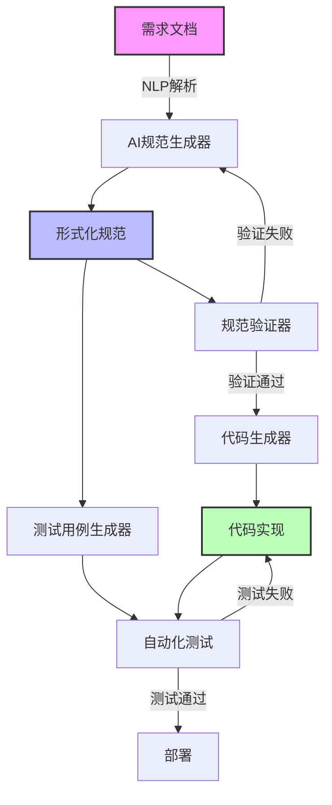

## 概念定义

规范驱动开发（Specification-Driven Development，SDD）是一种以**形式化规范为核心**的软件开发方法论，强调在编码之前**明确定义系统行为规范**，并基于这些规范驱动整个开发周期，包括设计、实现、测试和验证。

## 技术原理

### 核心思想
规范驱动开发建立在以下基础原理之上：

1. **规范即真理**：系统规范是单一事实源，所有实现必须与之保持一致
2. **早期验证**：在开发早期发现和修正规范中的问题
3. **自动化一致性检查**：通过形式化方法验证实现与规范的一致性
4. **AI辅助规范生成**：利用大语言模型从需求描述自动生成形式化规范

### 技术架构



### 规范表示方法

1. **代数规范**: 使用代数公理定义抽象数据类型
2. **时序规范**: 描述系统状态随时间的变化
3. **行为器规范**: 基于Actor模型描述并发行为
4. **契约式设计**: 使用前置条件、后置条件和不变式
5. **类型驱动规范**: 依赖类型和 refinement types

## 实际应用场景

### Web应用开发
- **前端组件规范**: 定义组件的Props类型、State结构和事件处理契约
- **API接口规范**: OpenAPI/Swagger规范自动生成客户端和服务端代码
- **数据库模式**: 从逻辑数据模型生成数据库模式和ORM代码

### 分布式系统
- **微服务契约**: 使用gRPC/GraphQL Schema定义服务间通信协议
- **事件驱动架构**: 定义事件模式和处理规则，自动生成事件处理器
- **配置管理**: 规范化的配置模式，支持环境特定配置生成

### AI系统开发
- **ML模型规范**: 定义模型输入输出格式、性能指标和约束条件
- **数据管道**: 数据转换和处理步骤的规范化描述
- **特征工程**: 特征定义和转换逻辑的形式化规范

## 技术架构与实现

### 规范层
```typescript
interface SpecificationLayer<T> {
  // 语法规范
  syntax: SyntaxSpecification<T>;
  // 语义规范
  semantics: SemanticSpecification<T>;
  // 性能规范
  performance: PerformanceSpecification;
  // 约束规范
  constraints: ConstraintSpecification[];
}

// 具体规范示例
interface APIEndpointSpec {
  path: string;
  method: HTTPMethod;
  request: {
    headers?: HeaderSchema;
    body?: SchemaDefinition;
    parameters?: ParameterSchema[];
  };
  response: {
    statusCodes: StatusCodeDefinition[];
    headers?: HeaderSchema;
    body?: SchemaDefinition;
  };
  errors: ErrorResponse[];
  performance: PerformanceRequirement;
}
```

### 验证层
```python
class SpecificationValidator:
    def validate_syntax(self, spec: Specification) -> ValidationResult:
        """验证规范的语法正确性"""

    def validate_semantics(self, spec: Specification) -> ValidationResult:
        """验证规范的语义一致性"""

    def validate_completeness(self, spec: Specification) -> ValidationResult:
        """验证规范的完整性"""

    def check_circular_dependencies(self, spec: Specification) -> bool:
        """检查循环依赖"""
```

### 代码生成层
```rust
pub struct CodeGenerator {
    templates: HashMap<String, Template>,
    transformers: Vec<Box<dyn SpecTransformer>>,
}

impl CodeGenerator {
    pub fn generate(&self, spec: &Specification) -> GeneratedCode {
        let mut code = GeneratedCode::new();

        for transformer in &self.transformers {
            let transformed = transformer.transform(spec);
            code.merge(transformed);
        }

        self.apply_templates(&mut code);
        code
    }
}
```

## 最佳实践

### 规范设计原则
1. **原子性**: 每个规范应该描述单一、内聚的概念
2. **可组合性**: 规范之间应该能够通过组合构建更复杂的系统
3. **一致性**: 不同层次的规范之间保持一致性
4. **可验证性**: 规范必须能够通过自动化工具验证
5. **可演化性**: 规范应该支持版本管理和渐进式演化

### 开发流程建议
1. **需求澄清阶段**：使用结构化模板收集和整理需求
2. **规范定义阶段**：将需求转换为形式化规范
3. **规范评审阶段**：多方参与，确保规范的完整性
4. **原型验证阶段**：基于规范快速构建原型进行验证
5. **迭代优化阶段**：根据反馈不断完善规范

### AI辅助规范生成工具链
```yaml
# AI规范生成配置文件
ai_spec_generation:
  input_adapters:
    - type: natural_language
      model: "gpt-4-large"
      temperature: 0.1
      system_prompt: "you_are_a_specification_expert"

    - type: user_story
      template: "as_a_{role}_i_want_{feature}_so_that_{benefit}"

  output_formats:
    - name: "openapi_3.0"
      schema: "./schemas/openapi-3.0.json"

    - name: "graphql_schema"
      schema: "./schemas/graphql-schema.graphql"

  validation_rules:
    - rule: "no_ambiguous_fields"
      severity: "error"

    - rule: "consistent_naming_convention"
      severity: "warning"
```

## 优缺点分析

## 优势
- [tech] **质量保证**: 通过形式化验证确保系统正确性 #quality 早期发现并修复设计缺陷，减少后期修改成本
- [design] **设计一致性**: 规范作为单一事实源确保团队理解一致 #architecture 消除不同开发者之间的认知偏差
- [method] **自动化程度高**: 支持代码生成、测试生成、文档生成 #automation 大幅提升开发效率
- [technique] **可维护性强**: 变更影响范围可通过规范分析自动确定 #maintainability 支持精确的变更影响分析
- [insight] **AI友好**: 规范格式便于AI理解和处理，支持智能化工具 #ai_integration 自然语言到形式化规范的自动生成

## 局限性
- [problem] **学习曲线陡峭**: 需要掌握形式化方法和规范语言 #learning_curve 对开发团队技术要求较高
- [issue] **前期投入大**: 规范建立和验证需要大量前期工作 #initial_investment 可能延长项目启动时间
- [constraint] **灵活性限制**: 过度严格的规范可能限制创新和响应变化 #flexibility 需要平衡规范严格性和灵活性
- [challenge] **工具生态不成熟**: 缺乏完善的工具链支持 #tool_ecosystem 工具集成和标准化仍在发展中

## 技术发展趋势
1. **AI驱动规范进化**: 大语言模型将能够更好地理解和生成形式化规范
2. **多模态规范表示**: 结合图形、自然语言和形式化符号的混合表示
3. **实时规范验证**: 开发过程中的即时规范一致性检查
4. **跨语言规范统一**: 支持多种编程语言的规范标准化

## 实施建议
1. **渐进式采用**: 从关键核心模块开始，逐步扩展到整个系统
2. **工具选择**: 选择成熟的规范语言和工具，如TLA+、Alloy、Coq等
3. **团队培训**: 投资团队的规范方法培训，建立专业能力
4. **持续集成**: 将规范验证集成到CI/CD流程中

## Relations
- extends [[领域驱动设计_DDD核心概念]] 规范驱动开发可以看作是DDD中限界上下文和统一语言的进一步形式化
- pairs_with [[AI编程助手技术栈]] AI辅助生成和验证规范，提升效率
- contrasts_with [[传统测试驱动开发_TDD]] 规范驱动更关注形式化验证而非单测试覆盖
- leads_to [[自动化代码生成技术]] 完整的形式化规范支持从设计到实现的自动化
- requires [[形式化方法基础]] 需要扎实的数学逻辑和形式化验证基础